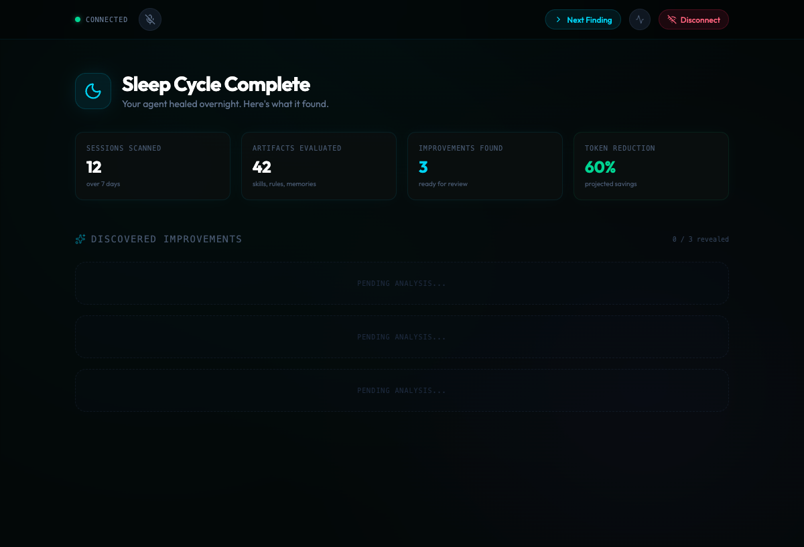
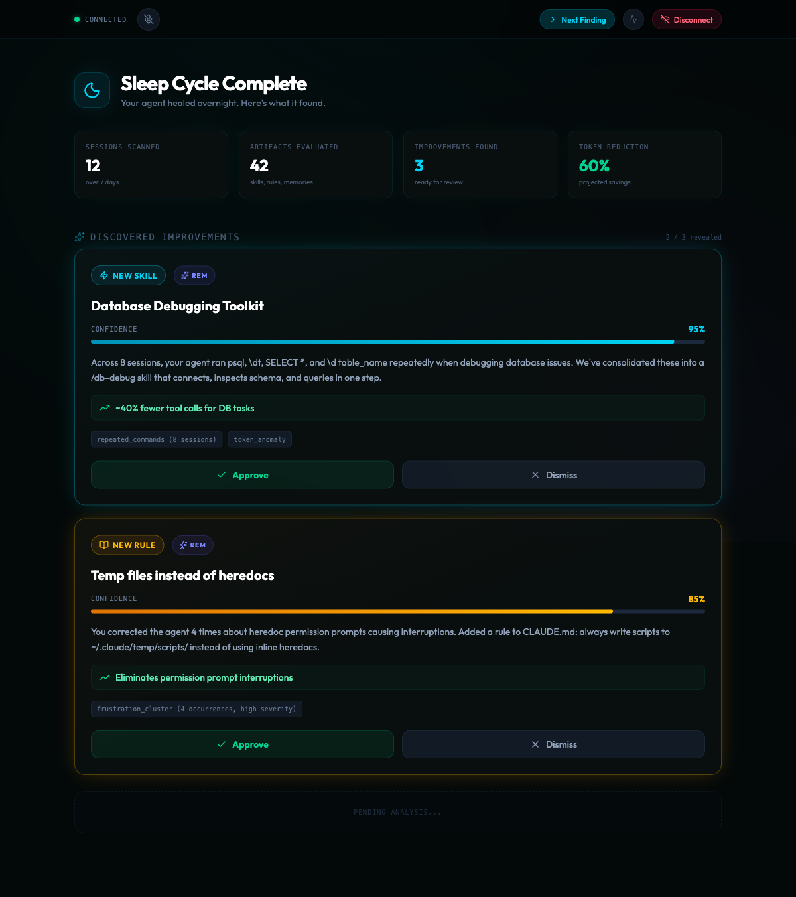
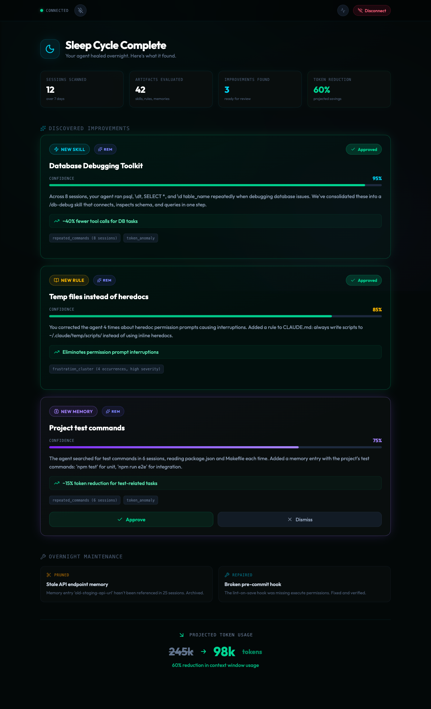

# Sleep Like A Baby

Bio-inspired self-healing maintenance for Claude Code's `.claude/` folder. Built for the [Continual Learning Hackathon](https://lu.ma/continual-learning) (Feb 21, 2026).

**The idea:** Every biological organism heals while it sleeps — consolidating memory, pruning unused synapses, clearing waste, dreaming up new connections. What if AI agents did the same thing?

**The proof:** Run the same task before and after a sleep cycle. Measure the token reduction in Braintrust.

## How It Works

```
DAYTIME (automatic)
═══════════════════
User session → Braintrust CC Plugin captures traces → Online scorers run:
  • FrustrationDetector (Gemini 2.5 Flash as judge)
  • TokenEfficiency (normalized token score)
  • ToolUsageSummary (tool invocation counts)

NIGHTTIME (sleep.sh)
════════════════════
N1 Light Sleep  → MEASURE  (Haiku)  — scan metrics, detect patterns
N2 Medium Sleep → PRUNE    (Sonnet) — trail evaporation, remove dead weight
N3 Deep Sleep   → REPAIR   (Sonnet) — health-check hooks/skills/memory, fix broken refs
REM Dream       → CREATE   (Opus)   — synthesize new artifacts from confirmed patterns
```

Each stage maps to real sleep neuroscience:

| Stage | Biology | Agent Equivalent |
|-------|---------|-----------------|
| N1 | Light sleep — pattern detection, sensory gating | Scan Braintrust metrics + local artifacts for frustration clusters, token anomalies, repeated commands |
| N2 | Medium sleep — synaptic downscaling (Tononi's hypothesis) | Trail evaporation: decay unused artifact relevance, prune when below threshold |
| N3 | Deep sleep — glymphatic waste clearance, tissue repair | Health-check hooks, fix broken references, clean orphaned temp files |
| REM | Dreaming — creative recombination, memory integration | Two-signal activation: create new hooks/skills/memory from confirmed patterns |

## Voice-Driven Sleep Report Dashboard

The demo frontend — a Gemini Live voice agent narrates the sleep cycle findings while improvement cards appear one-by-one. The presenter approves or dismisses each improvement by voice or button.







### How the dashboard works

1. Connects to Gemini Live (BidiGenerateContent WebSocket) with a system instruction containing the sleep report
2. Gemini narrates the report conversationally and calls tools to control the UI:
   - `show_next_finding` — reveals the next improvement card
   - `approve_improvement(id)` — marks an improvement as approved
   - `dismiss_improvement(id)` — dismisses an improvement
3. Manual buttons provide fallback if the voice model doesn't call the tool
4. After all improvements are reviewed, maintenance actions and the token reduction headline appear

### Running the dashboard

```bash
cd demo/gemini-live-demo
cp .env.example .env.local  # Add your Gemini API key
npm install
npm run dev
```

## Project Structure

```
sleep-agent/
├── sleep.sh                    # Main orchestrator
├── stages/                     # System prompts per sleep stage
│   ├── n1-measure.md           # → Haiku (read-only)
│   ├── n2-prune.md             # → Sonnet (edit)
│   ├── n3-repair.md            # → Sonnet (edit + bash)
│   └── rem-create.md           # → Opus (full write)
├── schemas/                    # JSON output schemas per stage
├── lib/
│   ├── query_braintrust.py     # BTQL queries for aggregated metrics
│   ├── upload_to_braintrust.py # Bulk upload JSONL sessions as traces
│   ├── collect_artifacts.py    # Snapshot .claude/ artifacts
│   └── generate_report.py      # Morning sleep report
├── scorers/
│   ├── token_efficiency.py     # Braintrust scorer function
│   ├── tool_usage_summary.py   # Braintrust scorer function
│   └── frustration_detector.py # LLMClassifier reference (configured in UI)
├── state/                      # Persistent state across cycles
│   ├── artifact-registry.json
│   ├── pending-signals.json
│   └── cycle-history.json
└── reports/                    # Generated sleep reports

demo/
├── seed-entropy.sh             # Pre-populate .claude/ with demo entropy
├── demo-task.md                # Before/after comparison task
├── run-demo.sh                 # Full demo flow
└── gemini-live-demo/           # Voice-driven sleep report frontend
    ├── src/
    │   ├── components/
    │   │   ├── SleepDashboard.tsx   # Main dashboard page
    │   │   ├── ImprovementCard.tsx  # Improvement card with approve/dismiss
    │   │   └── GeminiLive.tsx       # Standalone voice demo (original)
    │   ├── data/
    │   │   └── sleep-report.ts      # Report data, system instruction, tool defs
    │   └── services/
    │       └── live-client.ts       # WebSocket client with tool calling
    └── package.json

research/                       # 15,000+ lines across 22 files
docs/                           # Principles, metaphors, toolkit
hackathon/                      # Strategy + measurement docs
```

## Key Design Decisions

**Staged model escalation.** Haiku does cheap measurement, Sonnet does focused repair, Opus does creative synthesis. Mirrors how biology allocates energy — you don't send your most expensive immune cells to every paper cut.

**Two-signal activation.** A pattern must appear in two separate sleep cycles before the system creates an artifact from it. Prevents hallucinated improvements from single-session noise. Inspired by the immune system's co-stimulation requirement.

**Trail evaporation.** Every artifact has a relevance score that decays each cycle (`relevance *= 0.9`). Used artifacts get reinforced (`+1.0`). Unused artifacts fade and get pruned below 0.2. Inspired by ant colony pheromone trails and Tononi's synaptic homeostasis.

**Plugin/sleep-agent separation.** The Braintrust CC plugin handles per-trace capture and scoring. The sleep agent handles cross-session aggregation, persistent state, and file system modifications. `query_braintrust.py` is the explicit bridge.

## Quick Start

```bash
# 1. Set Braintrust API key
export BRAINTRUST_API_KEY="your-key"

# 2. Upload existing sessions to Braintrust
python3 sleep-agent/lib/upload_to_braintrust.py

# 3. Push scorer functions
cd sleep-agent/scorers
braintrust push token_efficiency.py
braintrust push tool_usage_summary.py

# 4. Configure FrustrationDetector in Braintrust UI
#    (LLMClassifier with Gemini 2.5 Flash — see scorers/frustration_detector.py)

# 5. Seed demo entropy and run
bash demo/seed-entropy.sh
bash sleep-agent/sleep.sh
```

## Full Demo

```bash
bash demo/run-demo.sh
```

This runs: seed entropy → before task → sleep cycle → after task → comparison.

## Sponsor Integration

| Sponsor | Role |
|---------|------|
| **Braintrust** | Trace capture (CC plugin), online scoring (3 scorers), BTQL aggregation, dashboard visualization |
| **Google Gemini** | FrustrationDetector uses Gemini 2.5 Flash as scorer model via Braintrust AI proxy |
| **Anthropic Claude** | The substrate being healed AND the tool used to build the system |

## Research Foundation

This project is grounded in 300+ sources across neuroscience, immunology, ecology, and distributed systems:

- **Tononi's Synaptic Homeostasis Hypothesis** → trail evaporation / pruning
- **Glymphatic waste clearance** → orphaned file cleanup / stale reference repair
- **Hippocampal replay** → cross-session pattern aggregation
- **REM dreaming** → creative artifact synthesis
- **Immune two-signal activation** → two-cycle confirmation before artifact creation
- **Ant colony stigmergy** → environmental traces as coordination mechanism
- **Alan Kay's cathedral architecture** → simple components, powerful arrangement

See [`SYNTHESIS.md`](SYNTHESIS.md) for the full synthesis of all 22 research files.
